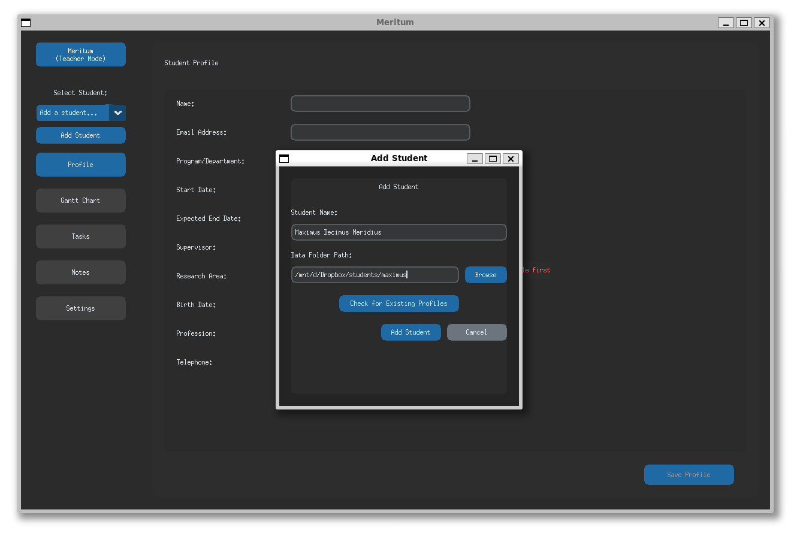

# meritum


[](https://pypi.org/project/meritum/)

A tool for tracking student progress using Gantt charts and task management, designed especially for academic contexts like undergraduate and Ph.D. programs.


## Features

- **Dual Mode Interface**: Separate views for teachers and students
- **Visual Progress Tracking**: Intuitive Gantt charts for project visualization
- **Task Management**: Create, assign, and track tasks with deadlines
- **Progress History**: Detailed history of task completion and progress
- **Note Taking**: Add detailed notes to tasks for better context
- **Profile Management**: Keep detailed student profiles in one place

## Installation

Install Meritum easily using pip:

```bash
pip install meritum
```

Or install directly from GitHub for the latest version:

```bash
pip install git+https://github.com/maurobedoya/meritum.git
```

## Usage

After installation, simply run:

```bash
python -m meritum
```

or 
```bash
meritum
```

On first run, you'll be prompted to choose either Teacher or Student mode.
[](https://raw.githubusercontent.com/maurobedoya/meritum/main/meritum/assets/01_meritum.png)

### Teacher Mode

Teachers can:
- Manage multiple student profiles
- Create and assign tasks
- Track progress across different students
- Add notes and feedback to student work

### Student Mode

Students can:
- View their assigned tasks
- Update task progress
- Add notes to tasks
- View their project timeline through Gantt charts

## Adding students

[](./meritum/assets/03_meritum.PNG)


## Requirements

- Python 3.7 or higher
- customtkinter 5.2.2 or higher

## License

This project is licensed under the MIT License - see the LICENSE file for details.

## Contributing

Contributions are welcome! Please feel free to submit a Pull Request.

1. Fork the repository
2. Create your feature branch (`git checkout -b feature/amazing-feature`)
3. Commit your changes (`git commit -m 'Add some amazing feature'`)
4. Push to the branch (`git push origin feature/amazing-feature`)
5. Open a Pull Request

## Acknowledgments

- Thanks to all contributors and testers
- Built with [CustomTkinter](https://github.com/TomSchimansky/CustomTkinter)
